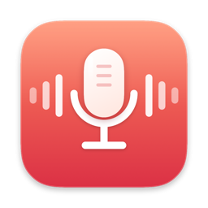
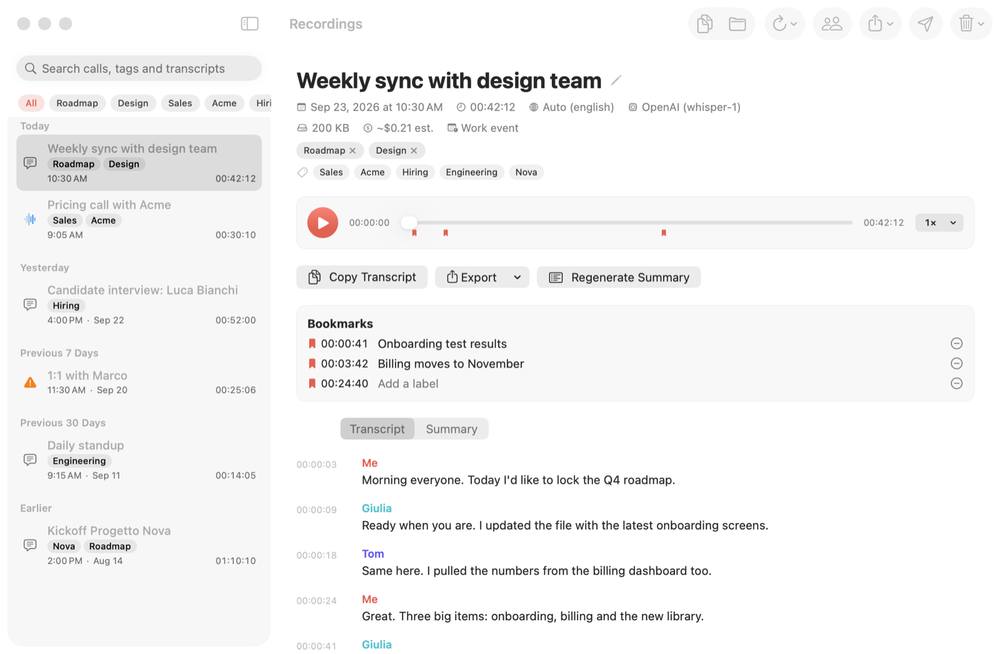
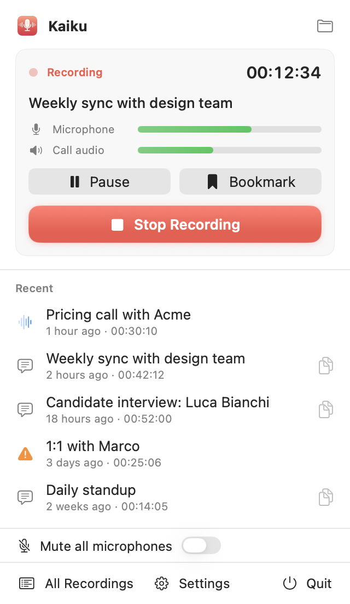
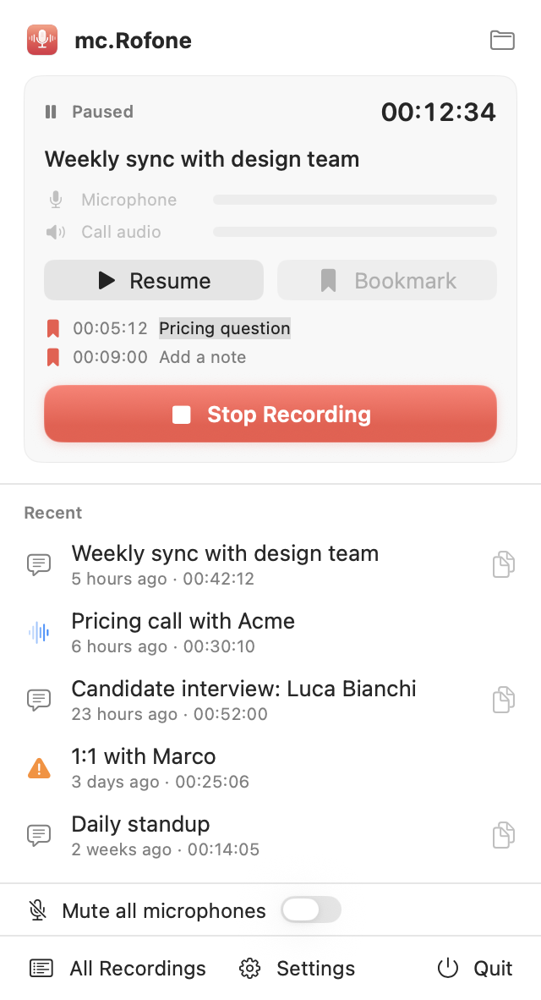
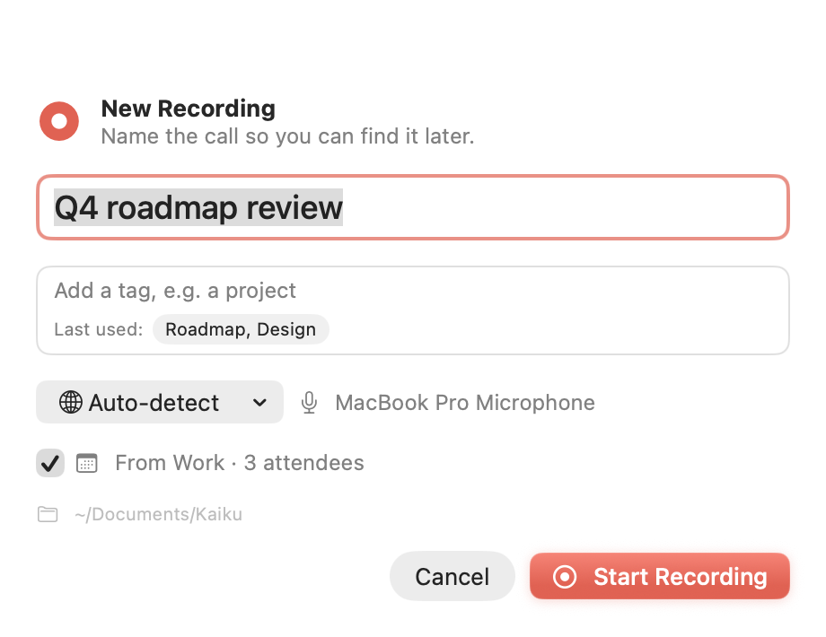
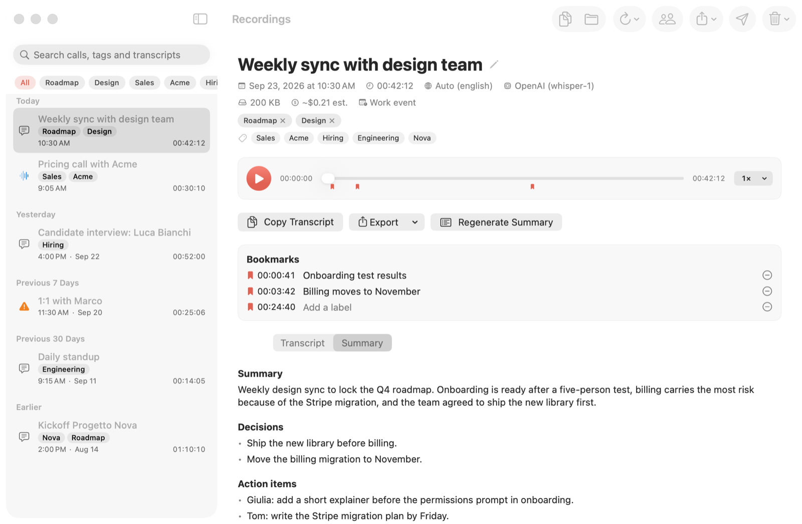
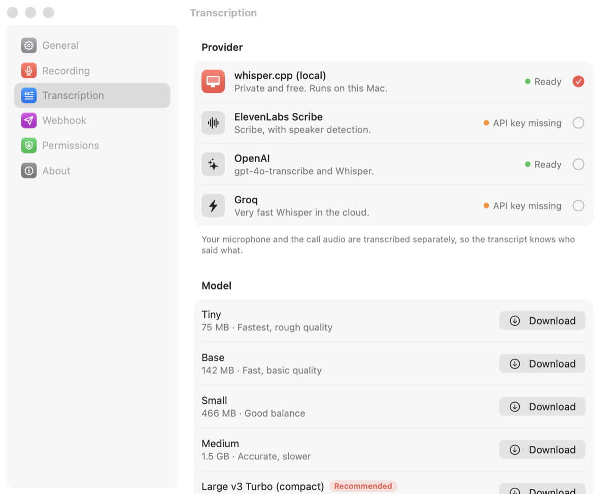
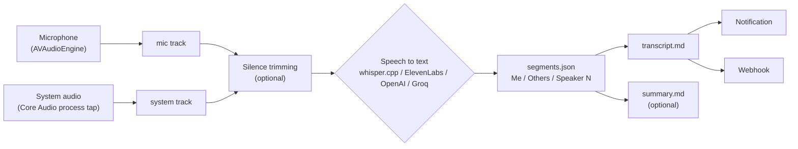

<div align="center">



# mc.Rofone

**Record and transcribe your calls on macOS. No bot joins the meeting, no subscription, your files stay yours.**

<sub>The name is a pun on *microfono*, Italian for microphone.</sub>

[](#install)
[](Package.swift)
[](LICENSE)
[](https://github.com/gabry-ts/mc.Rofone/releases/latest)
[](#install)

<picture>
  <source media="(prefers-color-scheme: dark)" srcset="docs/images/library-dark.png">
  
</picture>

</div>

## Why

Most call recorders either send a bot into your meeting or charge you every month. mc.Rofone does neither. It lives in the menu bar, records your microphone and the Mac's audio directly, and hands the result to the speech-to-text engine you pick:

- **No bot.** Nobody sees "Notetaker has joined". It records what your Mac hears.
- **No subscription.** Free and open source. Cloud providers are billed to your own key, at their list price, or you run whisper.cpp locally for free.
- **You own the files.** Every call is a plain folder with audio, `transcript.md` and `meta.json`.
- **Fully offline if you want.** whisper.cpp is bundled in the app, and models download from Settings.
- **Mute every mic in one click.** Option-click the menu bar icon: Zoom, Meet and Teams still show you as unmuted, but they only receive silence.

## Features

| | |
|---|---|
| **Record** | Mic and system audio on separate tracks (Core Audio process tap, no virtual driver). Asks for the title *when you start*, prefilled from the calendar event happening now, with tags and autocomplete. Pause / resume and bookmarks from the panel or global shortcuts. Never opens a Bluetooth headset mic, so your headphones stay in high quality. Survives output and mic changes mid-call. Crash safe. |
| **Transcribe** | whisper.cpp (local, bundled, in-app model manager), ElevenLabs Scribe, OpenAI, Groq. Auto language detection. "Me" vs "Others" from the two tracks, speaker diarization on the call audio where the provider supports it, rename speakers after the fact. Echo removal when you use speakers. Silence trimming before upload and a per-call cost estimate. |
| **Organize** | Library with search across titles, tags and transcripts, tag filter, inline player with bookmark markers and click-to-seek timestamps. Export to Markdown, TXT, SRT, VTT and DOCX. Multi-selection for bulk export, tagging, re-transcription and cleanup. Storage overview and optional cleanup of old audio. |
| **Automate** | Notification when the transcript is ready. Fully configurable webhook (method, headers, custom body templates). Optional summary with decisions and action items, using your own OpenAI, Anthropic or Groq key. Detects Zoom, Teams, Meet, Slack, FaceTime, Webex and Discord calls and offers to record. |
| **Mute** | Option-click the menu bar icon to mute every microphone on the Mac at once, Bluetooth included, without opening them. Call apps keep showing you as unmuted but receive silence. If an app raises the volume back, mc.Rofone lowers it again. Unmuting, quitting or relaunching after a crash restores every device exactly as it was. |
| **Privacy** | Everything is stored locally. API keys and webhook header values live in the Keychain. Audio leaves your Mac only to the provider you choose, and not at all with whisper.cpp. |

## Screenshots

<table>
<tr>
<td width="33%" align="center">
<picture>
  <source media="(prefers-color-scheme: dark)" srcset="docs/images/panel-recording-dark.png">
  
</picture>
<br><sub>Menu bar panel while recording</sub>
</td>
<td width="33%" align="center">
<picture>
  <source media="(prefers-color-scheme: dark)" srcset="docs/images/panel-paused-dark.png">
  
</picture>
<br><sub>Paused, with bookmarks</sub>
</td>
<td width="33%" align="center">
<picture>
  <source media="(prefers-color-scheme: dark)" srcset="docs/images/title-prompt-dark.png">
  
</picture>
<br><sub>Title, tags and language at the start</sub>
</td>
</tr>
</table>

<picture>
  <source media="(prefers-color-scheme: dark)" srcset="docs/images/library-summary-dark.png">
  
</picture>
<p align="center"><sub>Optional summary with decisions and action items</sub></p>

<picture>
  <source media="(prefers-color-scheme: dark)" srcset="docs/images/settings-transcription-dark.png">
  
</picture>
<p align="center"><sub>Pick a provider, download a local model</sub></p>

## How it works



The two tracks are transcribed separately, so the transcript knows who said what. Timestamps are mapped back to the original timeline after trimming, so bookmarks, click-to-play and subtitles stay in sync.

## Install

1. Download the latest `mc.Rofone-<version>.dmg` from [Releases](https://github.com/gabry-ts/mc.Rofone/releases/latest) and drag the app to Applications.
2. The app is signed ad hoc and **not notarized**, so Gatekeeper blocks the first launch. Open it once, then go to **System Settings > Privacy & Security** and click **Open Anyway** (on macOS 14, right-click the app > Open also works).
3. Grant the permissions macOS asks for on the first recording:
   - **Microphone**: Privacy & Security > Microphone.
   - **System audio recording**: Privacy & Security > Screen & System Audio Recording > "System Audio Recording Only". Without it the system track is silent and the transcript only contains your side.
   - **Notifications**: for "Transcript ready", "Call detected" and "Recovered call".
   - **Calendar** (optional): to name recordings after the current event and suggest attendee names. Google and Outlook calendars must first be added in System Settings > Internet Accounts.

Requires macOS 14.2 or later (process taps). Universal binary for Apple Silicon and Intel.

## Quick start

1. Launch mc.Rofone. A short welcome guide covers permissions, provider and shortcut.
2. Pick a provider in **Settings > Transcription**. For fully local transcription keep whisper.cpp and download a model (Large v3 Turbo compact is the recommended one). For cloud providers paste your API key; **Test** sends a one-second request.
3. Click the menu bar icon > **Start Recording…** (or press ⌃⌥⌘R anywhere). Type a title, add tags, press Enter.
4. Talk. Pause, resume and drop bookmarks as you go.
5. **Stop Recording**. Transcription runs in the background and a notification opens the transcript.

## Providers

API keys are stored in the macOS Keychain, everything else in UserDefaults.

| Provider | Where it runs | Default model | Speaker diarization | Est. price / hour |
|---|---|---|---|---|
| whisper.cpp | Local, offline | model you download | No ("Me" / "Others" only) | free |
| ElevenLabs Scribe | Cloud | `scribe_v2` | Yes | $0.22 |
| OpenAI | Cloud | `gpt-4o-transcribe` | With `gpt-4o-transcribe-diarize` | $0.18 to $0.36 |
| Groq | Cloud | `whisper-large-v3-turbo` | No | $0.04 (`whisper-large-v3`: $0.111) |

Prices are **estimates** from list prices checked in September 2026 (editable in Settings > Transcription > Cost Estimate). Free tiers, minimum billing and plan discounts are not taken into account. Full default table:

| Model | $/hour |
|---|---|
| ElevenLabs `scribe_v2`, `scribe_v1` | 0.22 |
| OpenAI `gpt-4o-transcribe`, `gpt-4o-transcribe-diarize`, `whisper-1` | 0.36 |
| OpenAI `gpt-transcribe` | 0.27 |
| OpenAI `gpt-4o-mini-transcribe` | 0.18 |
| Groq `whisper-large-v3-turbo` | 0.04 |
| Groq `whisper-large-v3` | 0.111 |

OpenAI model behaviour:

- `whisper-1`: `verbose_json`, segment timestamps and detected language.
- `gpt-4o-transcribe` / `gpt-4o-mini-transcribe`: plain text only, so audio is sent in 1-minute chunks and each chunk becomes one timestamped block. Pick `whisper-1` or the diarize model for finer timing.
- `gpt-4o-transcribe-diarize`: `diarized_json` with `chunking_strategy=auto`, speaker labels on the system track.

For cloud providers audio is compressed to mono 16 kHz 32 kbps AAC before upload. OpenAI and Groq requests are split into chunks (10 minutes, or 1 minute for text-only models) to stay under the 25 MB upload limit.

**Language.** Auto-detect by default (whisper.cpp gets `-l auto`). Settings offers Auto, Italian, English or any ISO code, and the title window overrides it per call.

**whisper.cpp models.** Settings > Transcription downloads them for you: Tiny (75 MB), Base (142 MB), Small (466 MB), Medium (1.5 GB), Large v3 Turbo compact (547 MB, recommended) and Large v3 Turbo (1.6 GB). They live in `~/Library/Application Support/mc.Rofone/models`. Avoid the `.en` models if you speak other languages.

### Summary

Off by default. Turn on *Summarize every call after transcription* in Settings > Transcription > Summary, or use **Generate Summary** in the library. Providers, all with your own key: OpenAI (`gpt-5-mini`, uses the OpenAI transcription key), Anthropic (its own key in the Keychain) and Groq (`openai/gpt-oss-120b`, uses the Groq key). The prompt is editable (`{{title}}` and `{{transcript}}` are filled in); the default asks for a short summary, decisions and action items in the transcript's language. The result is saved as `summary.md` and included in the webhook.

## Output

Default base folder: `~/Documents/mc.Rofone` (changeable in Settings).

```
~/Documents/mc.Rofone/
  2026-09-23_1430_weekly-sync/
    meta.json        title, date, duration, language, provider, status, speaker names,
                     tags, pauses, bookmarks, calendar event, estimated cost, output routes,
                     mute intervals
    segments.json    raw timed segments with original speaker labels
    mic.m4a          your microphone
    system.m4a       everything played by the Mac (the other participants)
    mixed.m4a        both tracks mixed, for listening
    transcript.md
    summary.md       only if you use summaries
```

While recording, tracks are written as `mic.caf` and `system.caf` (uncompressed, about 1 GB per hour for both), converted to `.m4a` when you stop and removed once the `.m4a` files are checked.

`transcript.md` looks like this:

```markdown
# Weekly sync

- **Date:** 2026-09-23 14:30
- **Duration:** 00:42:10
- **Provider:** OpenAI (whisper-1)
- **Language:** auto (detected: italian)
- **Audio:** mic.m4a, system.m4a, mixed.m4a

---

**[00:00:03] Me:** Ciao a tutti, iniziamo?

**[00:00:06] Others:** Sì, ci siamo.

🔖 [00:00:09] Bookmark: Budget question
```

A `- **Tags:**` line is added when the call has tags. Consecutive lines from the same speaker are merged. The mic track is labelled "Me", the system track "Others" (both configurable). With diarization (ElevenLabs, `gpt-4o-transcribe-diarize`) the system track is split into "Speaker 1", "Speaker 2", and so on. **Rename Speakers…** in the library maps them to real names (attendees from the calendar event are suggested); the mapping is saved in `meta.json` and `transcript.md` is regenerated from `segments.json`, so renaming is lossless.

## Webhook

Off by default. Configure it in Settings > Webhook:

- **URL** and **method** (POST, PUT or PATCH).
- **Headers**, e.g. `Authorization: Bearer <token>`. Names go to UserDefaults, values to the Keychain.
- **Body**: *Default JSON* or *Custom template*.
- **Send Test** fires it with the last recording (or sample data) and shows the status and the start of the response.

Failed deliveries are retried up to 3 times (1 s, 2 s, 4 s) on network errors, 429 and 5xx. A final failure shows a notification. Any call can be sent again from the library with **Resend Webhook**.

Default JSON body:

```json
{
  "title": "Weekly sync",
  "date": "2026-09-23T12:30:00Z",
  "duration_seconds": 2530,
  "language": "it",
  "folder_path": "/Users/me/Documents/mc.Rofone/2026-09-23_1430_weekly-sync",
  "transcript_path": "/Users/me/Documents/mc.Rofone/2026-09-23_1430_weekly-sync/transcript.md",
  "audio_paths": [
    "/Users/me/Documents/mc.Rofone/2026-09-23_1430_weekly-sync/mic.m4a",
    "/Users/me/Documents/mc.Rofone/2026-09-23_1430_weekly-sync/system.m4a",
    "/Users/me/Documents/mc.Rofone/2026-09-23_1430_weekly-sync/mixed.m4a"
  ],
  "provider": "OpenAI (whisper-1)",
  "transcript_markdown": "# Weekly sync\n\n...",
  "segments": [
    { "start": 3.1, "end": 5.8, "speaker": "Me", "text": "Ciao a tutti, iniziamo?" },
    { "start": 6.0, "end": 7.2, "speaker": "Anna", "text": "Sì, ci siamo." }
  ],
  "speaker_names": { "Speaker 1": "Anna" },
  "tags": ["Nova"],
  "bookmarks": [
    { "time": 723.4, "label": "Budget question" }
  ],
  "summary_markdown": "## Summary\n...",
  "estimated_cost_usd": 0.0853
}
```

`language` is the one you chose, or the detected one on auto. `bookmarks[].time` is in seconds of recorded audio. `summary_markdown` and `estimated_cost_usd` are `null` when not available. Segment speakers use the names set with Rename Speakers.

### Custom template

Write any body and set the Content-Type (default `application/json`). Placeholders:

`{{title}}` `{{date}}` `{{duration_seconds}}` `{{language}}` `{{provider}}` `{{folder_path}}` `{{transcript_path}}` `{{transcript_markdown}}` `{{segments_json}}` `{{audio_paths_json}}` `{{bookmarks_json}}` `{{summary_markdown}}` `{{estimated_cost_usd}}` `{{tags}}` `{{tags_json}}`

When the Content-Type contains `json`, text placeholders are JSON-escaped, so put them inside quotes. `{{segments_json}}`, `{{audio_paths_json}}`, `{{bookmarks_json}}`, `{{tags_json}}`, `{{duration_seconds}}` and `{{estimated_cost_usd}}` are inserted as raw JSON values. `{{tags}}` is a comma-separated list. Unknown placeholders are left untouched.

A chat-style message (for a Slack-compatible incoming webhook, for example):

```json
{
  "text": "*{{title}}* ({{tags}})\n{{summary_markdown}}\n\nTranscript: {{transcript_path}}"
}
```

A generic "create a page" payload for a notes tool or your own endpoint:

```json
{
  "name": "{{title}}",
  "date": "{{date}}",
  "seconds": {{duration_seconds}},
  "tags": {{tags_json}},
  "body": "{{transcript_markdown}}",
  "segments": {{segments_json}}
}
```

## Keyboard shortcuts

| Action | Shortcut |
|---|---|
| Start / stop recording (from any app) | ⌃⌥⌘R |
| Pause / resume (from any app) | ⌃⌥⌘P |
| Add bookmark (from any app) | ⌃⌥⌘B |
| Start Recording… in the panel | ⌘R |
| Pause / resume in the panel | ⌘P |
| Bookmark in the panel | ⌘B |
| Mute / unmute every microphone | Option-click the menu bar icon |

The global shortcuts can be changed or turned off in Settings > General. In the title window, Enter or Tab accepts a tag, ⌫ removes the last one, and "Last used" adds the previous call's tags in one click.

**Option-click mute.** mc.Rofone saves each input device's state, then turns on its mute switch or sets its input volume to 0. It only changes device settings and never opens a device, so a Bluetooth headset does not switch to its call profile. Zoom, Meet or Teams keep showing you as unmuted, but they receive silence. Unmuting restores every device exactly as it was, also on quit and on the next launch after a crash. Devices that allow neither (the iPhone Continuity mic, some virtual devices) are listed in the panel.

## More details

<details>
<summary><b>System audio capture and device changes</b></summary>

A global Core Audio process tap (`CATapDescription` + `AudioHardwareCreateProcessTap`) is attached to a private, tap-only aggregate device built on the current default output. Nothing is muted, no virtual audio driver is installed, and the output device is never reconfigured. The microphone is recorded separately with `AVAudioEngine`.

- Switching outputs mid-call (AirPods in or out, speakers from Control Center) rebuilds the tap about a second later; the gap is filled with silence so both tracks stay aligned, and a notification says "Audio output changed".
- If the recorded mic disappears, recording switches to the automatic choice without stopping. You can also switch mic from the panel while recording.
- **Automatic (avoid Bluetooth)** uses the default input unless it is a Bluetooth headset, in which case it uses the built-in mic. Opening a Bluetooth headset mic would switch it to its low-quality call profile for you and everyone else.
- All system sounds are recorded, including notifications and music.
- On loudspeakers your mic also hears the other side. mc.Rofone records which output was in use (`outputRoutes`) and, for the parts on speakers, hides "Me" lines that repeat the call audio (*Remove echo when using speakers*, on by default). Hidden lines stay in `segments.json` with `"droppedAsEcho": true`.
- Tracks are aligned by start time; drift over long calls is typically well under a second.
</details>

<details>
<summary><b>Crash recovery</b></summary>

Audio is written as CAF files that stay readable after a crash, a force quit or a power loss (at most the last fraction of a second is lost). On launch, calls left recording or paused are converted to `.m4a`, marked *Recovered*, and offered for transcription with a notification and a card in the panel.
</details>

<details>
<summary><b>Call detection</b></summary>

Settings > Recording > Call Detection (on by default). Every few seconds mc.Rofone asks Core Audio which processes are using an input device and matches them against Zoom, Microsoft Teams, Slack, FaceTime, Webex, Discord and browsers for Google Meet (Chrome, Safari, Arc, Edge, Firefox, Brave, Zen, Vivaldi). It never opens a microphone for this. Each app can be turned off.

- A call starting shows "Call detected in Zoom" with **Record** or **Dismiss**, or starts right away with *Start recording automatically*.
- When every meeting app stops using the mic, you get "Call seems to have ended" with **Stop Recording**, or recording stops by itself after 30 s to 5 min if you want.
</details>

<details>
<summary><b>Calendar</b></summary>

When a recording starts during an event (or within 10 minutes of its start), the title is prefilled with the event title and the event (title, calendar, attendees) is saved in `meta.json`. Attendee names are suggested in Rename Speakers. You can limit this to some calendars. Tags are never set automatically.
</details>

<details>
<summary><b>Silence trimming and cost</b></summary>

By default, for cloud providers only, pauses longer than 2 s below -45 dB are cut from a temporary copy of each track before upload, keeping a little audio around each cut. Originals are never changed and timestamps are mapped back. Threshold and minimum length are configurable, and trimming can be turned on for whisper.cpp too, or off. Each call stores `transcribedSeconds` (after trimming) and `estimatedCostUSD`.
</details>

<details>
<summary><b>Storage cleanup</b></summary>

Settings > General > Storage shows the space used. **Clean Up Now…** previews what would go to the Trash and asks first. *Delete old audio automatically* (off by default) does the same at launch and once a day. Only audio of calls that already have a transcript is removed; transcripts, summaries, bookmarks and `meta.json` stay.
</details>

## Privacy

- Recordings, transcripts and settings stay on your Mac, in a folder you choose.
- API keys and webhook header values are stored in the macOS Keychain.
- Audio leaves the Mac only when you pick a cloud provider, and only to that provider. With whisper.cpp nothing leaves the Mac.
- Summaries and the webhook are off until you turn them on.
- No analytics, no account, no server of ours.

## Troubleshooting

- **Show Error Details…** in the menu shows the full last error with a Copy button. Failed transcriptions can be retried from the menu or re-run with any provider from the library.
- **Permissions seem stuck** (common after rebuilding, since the app is signed ad hoc): remove the app from the list in System Settings and add it again, or reset them:

  ```sh
  tccutil reset Microphone com.gabrielepartiti.mcrofone
  tccutil reset AudioCapture com.gabrielepartiti.mcrofone
  tccutil reset Calendar com.gabrielepartiti.mcrofone
  ```
- **The other side is missing from the transcript**: allow mc.Rofone under Screen & System Audio Recording > System Audio Recording Only.
- **Headphones sound bad during calls**: keep the input device on *Automatic (avoid Bluetooth)* so mc.Rofone never opens the headset mic.
- **whisper.cpp says the model is missing**: download one in Settings > Transcription, or put a `ggml-*.bin` file in `~/Library/Application Support/mc.Rofone/models`.
- **Logs**: `/usr/bin/log show --last 1h --info --predicate 'subsystem == "com.gabrielepartiti.mcrofone"'`
- **Audio self-test** (records a few seconds and prints formats, levels and devices; permissions belong to the terminal here):

  ```sh
  build/mc.Rofone.app/Contents/MacOS/McRofone --selftest-audio 3
  ```

  Other headless checks: `--selftest-recovery`, `--selftest-trim`, `--selftest-audiotools`, `--selftest-detect`, `--selftest-devicechange`, `--selftest-mute`.

## Build from source

Needs Xcode (or the Command Line Tools) with Swift 6 and `cmake` (`brew install cmake`) to build whisper.cpp.

```sh
./scripts/build-app.sh      # build/mc.Rofone.app
open build/mc.Rofone.app
./scripts/make-dmg.sh       # build/mc.Rofone-<version>.dmg
swift test                  # unit tests
```

`build-app.sh` first runs `scripts/build-whisper.sh`, which clones a pinned whisper.cpp release into `vendor/` and builds a static, universal `whisper-cli` with Metal. It then builds the app for arm64 and x86_64, bundles `whisper-cli` and its license notice, and signs the app ad hoc. `make-dmg.sh` packages it with `hdiutil`, using only tools that ship with macOS.

For UI review, `McRofone --render-snapshots <dir>` renders every screen with sample data in light and dark mode (it briefly shows windows on screen), and `McRofone --render-icon <dir>` regenerates `AppIcon.icns`.

## Project structure

```
Sources/McRofone/        the app: menu bar, recording, providers, library, settings
  Audio/                 mic recorder, system audio tap, track writer, mic muter
  Providers/             whisper.cpp, ElevenLabs, OpenAI-compatible (OpenAI, Groq)
  Views/                 SwiftUI views
Sources/McRofoneCore/    pure logic: transcript and export formatting, webhook templates,
                         silence trimming, echo filter, cost estimates, meeting detection
Tests/McRofoneCoreTests/ unit tests for the core
scripts/                 build-whisper.sh, build-app.sh, make-dmg.sh
Resources/               Info.plist, app icon
```

## Contributing

Issues and pull requests are welcome. Please keep changes focused, run `swift test` and make sure `./scripts/build-app.sh` builds without warnings. For UI changes, attach before/after snapshots from `--render-snapshots`.

## License

Copyright (C) 2026 Gabriele Partiti

mc.Rofone is free software, released under the [GNU General Public License v3.0](LICENSE).

### Third-party notices

The app bundles [whisper.cpp](https://github.com/ggml-org/whisper.cpp), distributed under the MIT License. Its notice is included in the app at `mc.Rofone.app/Contents/Resources/ThirdPartyNotices.txt`, generated by `scripts/build-app.sh`.
