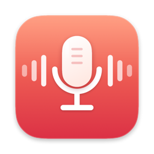
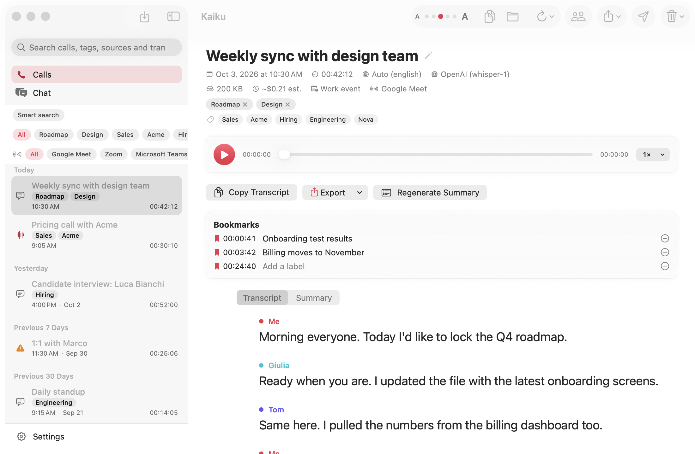

<div align="center">



# Kaiku

**Record and transcribe your calls on macOS. No bot joins the meeting, no subscription, your files stay yours.**

<sub>*Kaiku* is Finnish for echo: what was said, played back when you need it.</sub>

[](#requirements)
[](Package.swift)
[](LICENSE)
[](https://github.com/gabry-ts/kaiku/releases/latest)

<picture>
  <source media="(prefers-color-scheme: dark)" srcset="docs/images/library-dark.png">
  
</picture>

</div>

## Features

- Records mic and system audio on separate tracks, no virtual driver
- Transcribes with whisper.cpp locally, or ElevenLabs, OpenAI, Groq
- "Me" vs "Others" split, speaker diarization, rename speakers
- Library with search, tags, inline player and bookmarks
- Export to Markdown, TXT, SRT, VTT and DOCX
- Optional AI summary with decisions and action items

## Install

```sh
brew install --cask gabry-ts/tap/kaiku
```

Or download the latest `.dmg` from [Releases](https://github.com/gabry-ts/kaiku/releases/latest). Kaiku updates itself automatically after that.

## Requirements

macOS 14.2 or later, Apple Silicon or Intel; grants microphone, system audio and notification access on first recording (calendar and accessibility are optional).

## Build from source

```sh
SIGN_IDENTITY=- ./scripts/build-app.sh   # build/Kaiku.app
open build/Kaiku.app
```

## Privacy

Everything is stored locally; audio leaves your Mac only with the cloud provider you pick, and not at all with whisper.cpp.

## License

GNU General Public License v3.0. Copyright (C) 2026 Gabriele Partiti.
